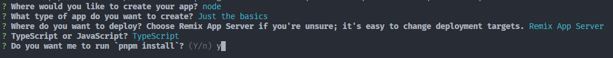
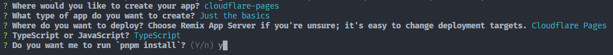
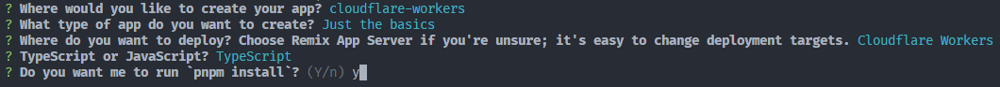
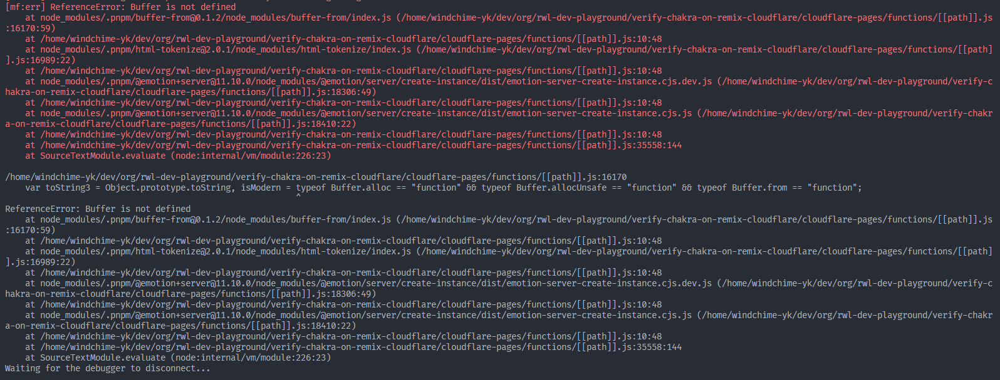

# Verify Chakra UI in Remix on Cloudflare

## 本リポジトリの目的
Remix上のChakra UIがCloudflare(PagesやWorker)で動くか検証する。  
比較対象としてRemix App Serverでの動作検証も行なう。

## 本リポジトリの達成目標
Cloudflare上でChakra UIがエラーなく動作すること。

## Chakra UIの適用方法
[公式ドキュメント](https://chakra-ui.com/getting-started/remix-guide)を参照。  
※ `@emotion/cache`が足らないので`pnpm i @emotion/cache^11`をする

## タスクリスト
- [x] 初期起動試験（`pnpm dev`）
  - [x] Remix App Server
  - [x] Cloudflare Pages
  - [x] Cloudflare Workers
- [ ] Chakra UI起動試験（`pnpm dev`）
  - [x] Remix App Server
  - [ ] Cloudflare Pages
  - [ ] Cloudflare Workers

## 構成
### Remix App Server

### Cloudflare Pages

### Cloudflare Workers

## 結果
### Remix App Server
Chakra UIの公式実装ドキュメントに従って無事に成功。

### Cloudflare Pages
#### Chakra UIの公式実装ドキュメントに従った実装
以下のエラーを出力して失敗。

## 参考資料
- 特になし
